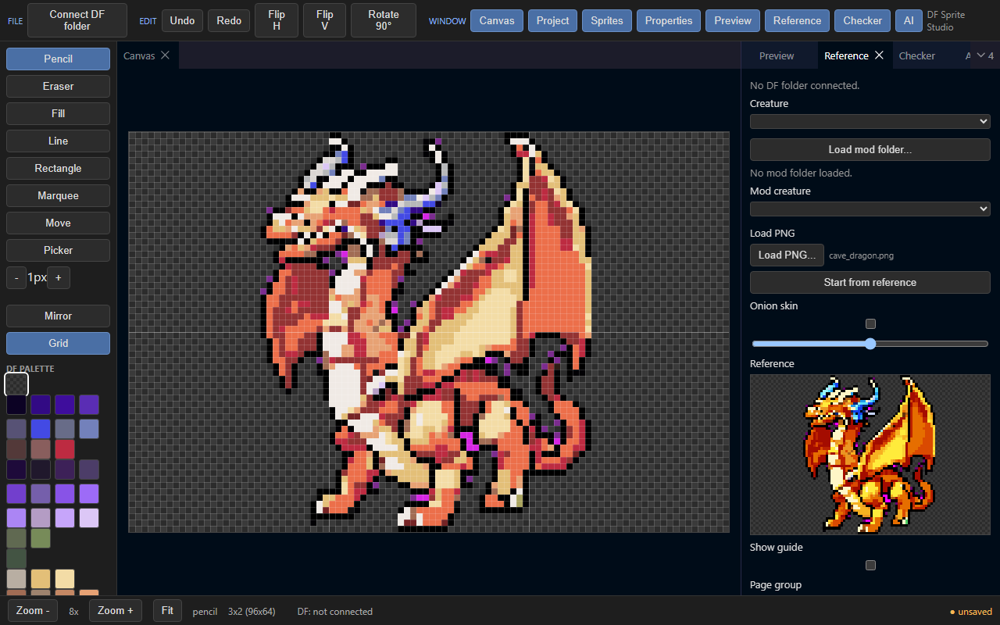

# DF Sprite Studio

A sprite editor for Dwarf Fortress graphics mods. You draw, and it writes the
graphics raws for you.

## ▶ [Use it in your browser](https://hearnoevil343.github.io/df-sprite-studio/)

No download, no install. Works in Chrome or Edge (they can open your DF
folder; Firefox cannot yet).



---

## What it does

Dwarf Fortress draws every creature with a tiny 32x32 picture. Each picture
needs a text file that tells the game where it lives on the sheet. Making both
by hand is slow and easy to get wrong.

This app is a coloring book made just for DF. The page is the right size and
the crayons are the game's own colors. When you finish, it writes the text
file for you. If you bring a picture from somewhere else, it shrinks and
recolors it until it looks like it belongs in the game.

## What it does

1. **Load your mod** (or your whole mods folder).
2. **See every creature that has no art yet.** The studio reads your
   creature raws and lists what is missing, sprite by sprite.
3. **Make the art.** Draw it, start from a vanilla sprite, or drop in any
   image and let the studio shrink and recolor it to DF style. Child, corpse,
   ghost and zombie versions get roughed out from your main sprite so you
   only touch them up.
4. **Save.** The sprite sheet and graphics raws are written for you, tile
   coordinates and all. Your existing raws keep their comments and order.

## Features

**Editor**
- 32x32 canvas locked to the DF palette
- Pencil, fill, picker, mirror, undo, auto-outline, color ramps
- Proportion guides taken from vanilla art
- Browse vanilla sprites as reference, with onion skin and side-by-side view
- Preview on grass, stone, snow and cavern floors at true size
- Dockable, resizable panels

**Raws**
- Real raw parser: every vanilla graphics file reads and writes back
  byte-identical
- Opening and saving a mod changes only what you changed; comments and order
  survive
- Templates for creatures, children, corpses, ghosts, vermin, swarms,
  multi-tile creatures and statues
- Layered creatures (dwarves and friends: body parts, clothing, layer
  conditions)

**Modder tools**
- Missing-art finder: scan a mod or the whole mods folder for creatures
  without sprites
- Auto-draft child, corpse, ghost and zombie versions from the default sprite
- Style checker: palette, outline, proportions, stray pixels, readability.
  It points at the exact pixels
- Validation for the mistakes that silently break graphics in game

**Image reducer**
- Turn any image (AI output, other pixel art) into a DF-ready sprite:
  background removal, crop, pixel grid detection, palette snap, outline
- Batch mode: folder in, sheet and raws out

**Optional AI**
- Restyle or generate sprites with a local image model (ComfyUI)
- Everything else works without AI or a GPU

## Getting started

**Browser:** use the link at the top.

**Windows app:** [download the latest release](https://github.com/Hearnoevil343/df-sprite-studio/releases/latest).

**From source:** needs [Node.js](https://nodejs.org) 23.6 or newer and a copy of Dwarf Fortress
(Steam version). Nothing from the game is bundled; the studio reads vanilla art
from your own install.

```
npm install
npm start
```

Then open http://localhost:8000. On Windows you can double-click
`Launch Studio.bat` instead. Either way, click **Connect DF folder** and pick
your Dwarf Fortress folder.

## Command line

The same engine runs without the editor, for scripts and CI:

```
node tools/studio.ts find-missing <mods folder>
node tools/studio.ts validate <mod folder>
node tools/studio.ts check <mod folder or PNGs>
node tools/studio.ts draft <mod folder> --creature <ID>
node tools/studio.ts reduce <folder of PNGs> --creature <ID>
```

Run `node tools/studio.ts` with no arguments for the full list.

## Tests

```
npm test
npm run roundtrip
```

`roundtrip` reads every vanilla graphics raw and checks that writing it back
gives the same bytes.

## Credits

Dwarf Fortress and its art belong to Bay 12 Games and Kitfox Games. This is a
fan tool and is not affiliated with them.
